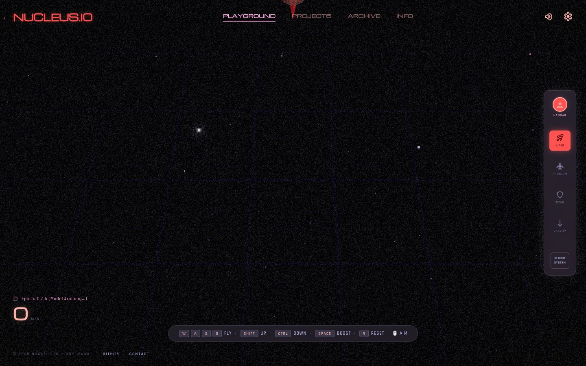

# NUCLEUS.IO

A flyable 3D portfolio: pilot a spaceship through a neon void, open project orbs, and collide with physics text.

**[Live demo](https://nucleus-io.vercel.app)**



## What it is

NUCLEUS.IO is Roy Wang's developer portfolio as a small WebGL world. Flight has inertia. Glass orbs open the projects. Neon lettering scatters when you hit it. A garbage-collector ring and a few orbiting bugs are there as toys, not a difficulty curve.

`WASD` fly · `Shift` / `Ctrl` up and down · `Space` boost · mouse aim · `R` reset.

## Highlights

- Post stack written in GLSL: bloom, vignette, chromatic aberration, film grain, and a boost-time radial blur
- Sound synthesized in the Web Audio API — no sample files
- Project orbs, a garbage-collector ring for “memory leak” cubes, and orbiting bugs
- Neon 3D text with impact physics

## Tech

Vanilla ES modules, [Three.js](https://threejs.org/) 0.160, and [Vite](https://vitejs.dev/). Three is the only npm dependency; the page also ships a CDN import map so the modules resolve in the browser.

## Run locally

Node.js 18+ and a browser with WebGL2.

```bash
npm install
npx vite --port 3000
```

Open [http://localhost:3000](http://localhost:3000). Serve it over HTTP — opening `index.html` via `file://` fails because the font loader needs CORS.
